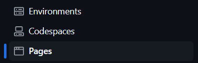
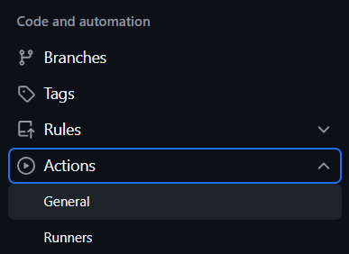
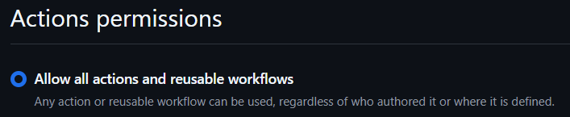
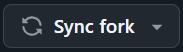
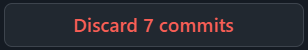

<p align="center">
   
   <h1 align="center">RepoGallery</h1>
   <h3 align="center">Just fork &amp; good to go!</h3>
   <p align="center">A beautiful showcase for all your GitHub repos. :art:</p>
</p>

<br>

<p align="center"> <a href="https://anlit75.github.io/RepoGallery">View Live Demo</a>  |  <a href="https://anson-cheng.github.io/RepoGallery-demo-dark">And More</a></p>

<br>

<p align="center"> <a href="README.md">English</a>  |  <a href="docs/README_cn_tw.md">繁體中文</a></p>

<br>

<h2 align="center">✨ Key Advantages ✨</h2>

<p align="center">
  🔹 Easy Setup • ⚡ Automated Deployment <br>
  🎨 Customizable • 💎 Modern Design <br>
  🔄 Effortless Updates • 🚀 Live Demo Available
</p>

<br>

## :gear: Prerequisites

Before you start, make sure you have a **GitHub account**.

## :rocket: Quick Start

### Step 1. **Fork This Repository**

Click the **Fork**  button at the top right of this page to create your own copy of the repository.

> [!TIP]\
> It’s recommended to keep the repository name as `RepoGallery`.

### Step 2. **GitHub Settings**

> [!IMPORTANT]\
> These settings **must be configured** via the GitHub Website (GitHub Mobile doesn't support these settings).

Make sure your repository is set up correctly:

#### **A. Configure GitHub Pages**
<details>
<summary>Go to <strong>Settings > Pages</strong></summary>
   
</details>

<details>
<summary>✅ Set <code>Build and deployment</code> <strong>Source</strong> to <strong>GitHub Actions</strong></summary>
   
</details>

#### **B. Enable GitHub Actions**
<details>
<summary>Go to <strong>Settings > Actions > General</strong></summary>
   
</details>

<details>
<summary>✅ Set <code>Action permissions</code> to <strong>Allow all actions and reusable workflows</strong></summary>
   
</details>

#### **C. Enable Workflows**
Navigate to the **Actions**  tab
 1. You will see the **Workflows** are disabled in default
      <details>
      <summary>Click the <strong>I understand my workflows, go ahead and enable them</strong> button</summary>
         <p align="left"></p>
      </details>
 2. Select the **RepoGallery** workflow from the left sidebar
 3. You will see the **Scheduled workflows are disabled by default in forks** warning message
      <details>
      <summary>Click the <strong>Enable workflow</strong> button</summary>
         <p align="left"></p>
      </details>

### Step 3. **Manual Trigger GitHub Action (Optional but Recommended)**

> [!TIP]\
> If you want to customize your showcase, **skip this step and go to Step 4**.

To ensure GitHub Actions is working properly, manually trigger the workflow:

1. Go to the **Actions**  tab
2. Select the **RepoGallery** workflow on the left sidebar
3. Click the **Run workflow** button

> [!NOTE]\
> The workflow will also run automatically **every day at UTC 00:00** 🕛.\
> **Any `push` to the `main` branch will also trigger the workflow**.

### Step 4. **Personalization (Optional)**

:art: Customize your showcase by editing the `config.yaml`. You can:
- Change the website title
- Adjust the theme colors
- and more!

After editing, **commit and push** your changes.

> [!TIP]\
> If you **didn’t** manually trigger Step 3, this `push` **will trigger the workflow and deploy your page automatically**.\
> For more usage details, please refer to the [**config.yaml**](config.yaml) file.

### Step 5. **View Your Awesome RepoGallery Page**

Once GitHub Actions has successfully run and GitHub Pages is deployed (this may take a few minutes), your showcase will be available at:

📌 `https://<your-github-username>.github.io/RepoGallery`

> [!TIP]\
> You can also find the URL in your repository’s **About** settings by clicking **Use your GitHub Pages website**.

## 🔄 How to Sync with Upstream

If you want to keep your forked repository updated with the latest changes from the RepoGallery, follow these steps:

### **A. If you DID NOT modify config.yaml or don’t mind losing your changes**
1. Go to your forked repository
2. Click **Sync Fork** <br>
   
3. Click **Discard n commits** <br>
   
4. Done!

> [!WARNING]\
> If you want to keep your changes, **DO NOT** click **Discard n commits**.\
> This will reset your fork to match the original repository.

### **B. If you DID modify config.yaml and want to keep your changes**
Run the following commands in your terminal:
```bash
#!/bin/bash
cd RepoGallery
chmod +x sync.sh
./sync.sh
```

## 🛠 How It Works (For the Curious)

When GitHub Actions (`repo_gallery.yaml`) runs, it automatically executes `generate_html.py`, which:

1. Reads `config.yaml`
2. Uses the templates from the `templates/` folder to generate a new html file

Then GitHub Actions will deploy the latest changes to GitHub Pages.

### Want to learn more?
Check out:
- The scripts inside the `script/` folder
- The templates inside the `templates/` folder

## ☕ Buy me a coffee
Enjoying this project? Keep me caffeinated so I can keep improving it! <br>
Support my work on Buy Me a Coffee :sparkling_heart:

<a href="https://www.buymeacoffee.com/anlit" target="_blank"></a>

## 📄 License

This project is licensed under the [Apache License 2.0](LICENSE)
