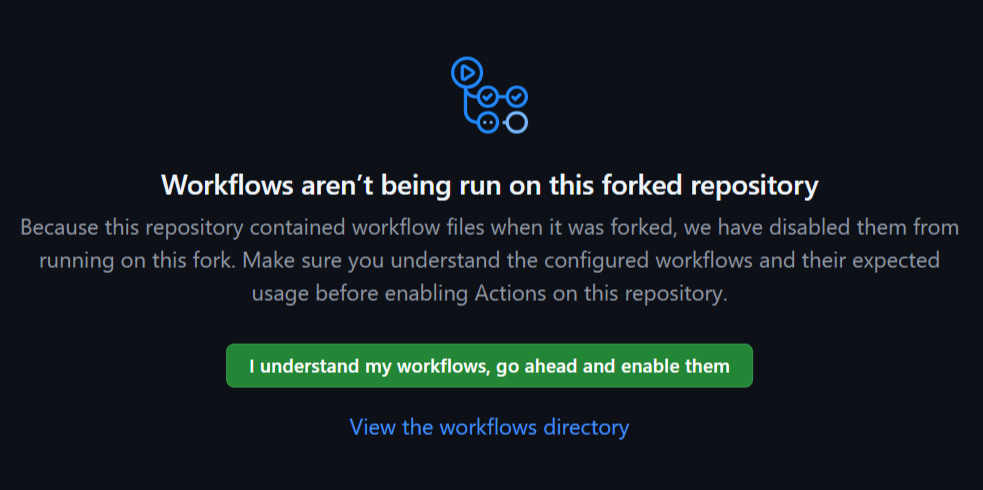
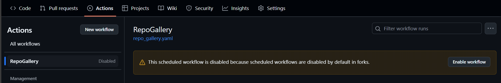

<p align="center">
   
   <h1 align="center">RepoGallery</h1>
   <h3 align="center">Just fork &amp; good to go!</h3>
   <p align="center">A beautiful showcase for all your GitHub repos. :art:</p>
</p>

<p align="center"> <a href="https://anlit75.github.io/RepoGallery">View Live Demo </a> | <a href="https://anson-cheng.github.io/RepoGallery-demo-dark"> And More</a></p>

## :gear: Prerequisites

Before you start, make sure you have a **GitHub account**.

## :rocket: Quick Start

### Step 1. **Fork This Repository**

Click the **Fork** button at the top right of this page to create your own copy of the repository.

> [!TIP]\
> It’s recommended to keep the repository name as `RepoGallery`.

### Step 2. **GitHub Settings**

> [!IMPORTANT]\
> These settings **must be configured** via the GitHub Web/Desktop interface.

Make sure your repository is set up correctly:

#### **A. Configure GitHub Pages**
1. Go to your forked repository
2. Go to **Settings > Pages**
   - Under `Build and deployment`: ✅ Set **Source** to **GitHub Actions**

#### **B. Enable GitHub Actions**
1. Go to **Settings > Actions > General**
   - Under `Actions permissions`: ✅ **Allow all actions and reusable workflows**
   - Under `Workflow permissions`: ✅ **Read and write permissions**
   - Under `Artifact and log retention` (Optional): Set **Artifact and log retention** to **1 days**
   - **Save the settings**
2. Navigate to the **Actions** tab
   1. You will see the **Workflows** are disabled in default
      <p align="left"></p>
   2. Click the **I understand my workflows, go ahead and enable them** button
   3. Select the **RepoGallery** workflow from the left sidebar
   4. You will see the **Scheduled workflows are disabled by default in forks** warning message
      <p align="left"></p>
   5. Click the **Enable workflow** button

### Step 3. **Manual GitHub Action Trigger (Optional but Recommended)**

> [!TIP]\
> If you want to customize your showcase, skip this step and go to Step 4.

To ensure GitHub Actions is working properly, manually trigger the workflow:

1. Go to the **Actions** tab
2. Select the **RepoGallery** workflow on the left sidebar
3. Click the **Run workflow** button

> [!NOTE]\
> The workflow will also run automatically **every day at UTC 00:00** 🕛.\
> **Any `push` to the `main` branch will also trigger the workflow**.\
> **If the workflow fails**, check the **workflow runs** for error logs.

### Step 4. **Personalization (Optional)**

:art: Customize your showcase by editing the `config.yaml`. You can:
- Change the website title
- Adjust the theme colors
- and more!

After editing, **commit and push** your changes. This will automatically trigger GitHub Actions to regenerate and deploy your page.

> [!TIP]\
> If you **didn’t** manually trigger Step 3, this `push` **will trigger the workflow automatically**.

### Step 5. **View Your Awesome RepoGallery Page**

Once GitHub Actions has successfully run and GitHub Pages is deployed (this may take a few minutes), your showcase will be available at:

📌 `https://<your-github-username>.github.io/RepoGallery`

> [!TIP]\
> You can also find the URL in your repository’s **About** settings by clicking **Use your GitHub Pages website**.

## 🔄 How to Sync with Upstream

If you want to keep your forked repository updated with the latest changes from the RepoGallery, follow these steps:

### **A. If you DID NOT modify `config.yaml` or don’t mind losing your changes**
1. Go to your forked repository
2. Click **Sync fork**
3. Click **Discard n commits**
4. Done!

> [!WARNING]\
> If you want to keep your changes, **DO NOT** click **Discard n commits**.\
> This will reset your fork to match the original repository.

### **B. If you DID modify `config.yaml` and want to keep your changes**
Run the following commands in your terminal:
```bash
#!/bin/bash
cd RepoGallery
chmod +x sync.sh
./sync.sh
```

## 🛠 How It Works (For the Curious)

When GitHub Actions (`repo_gallery.yaml`) runs, it automatically executes `generate_html.py`, which:

1. Reads `config.yaml`
2. Uses the templates from the `templates/` folder to generate a new `index.html`

Then GitHub Actions will deploy the latest changes to GitHub Pages.

### Want to learn more?
Check out:
- The scripts inside the `script/` folder
- The templates inside the `templates/` folder

## 📄 License

This project is licensed under the [Apache License 2.0](LICENSE)
